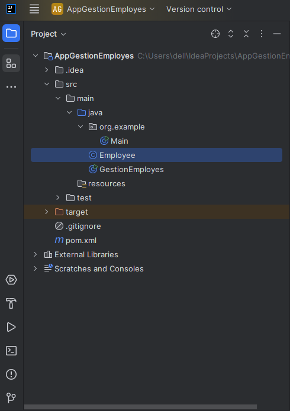
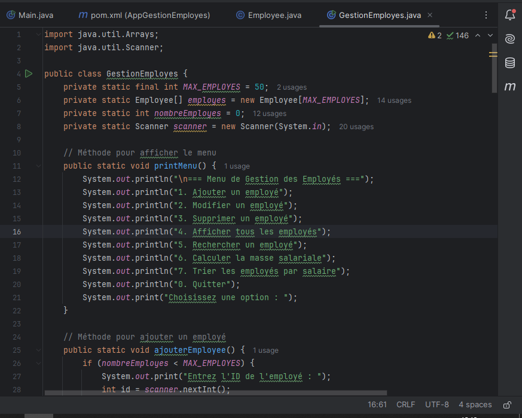
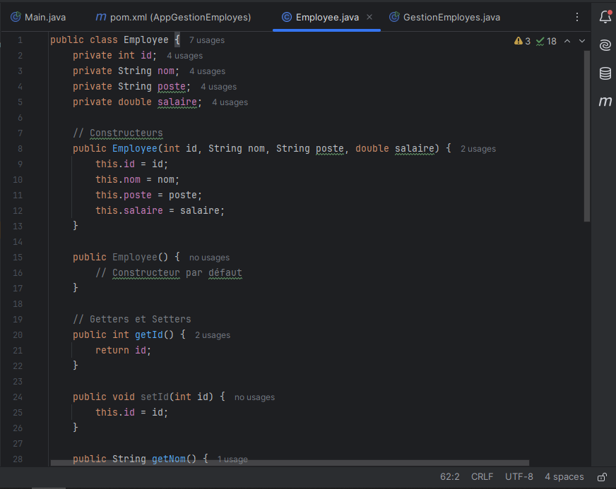
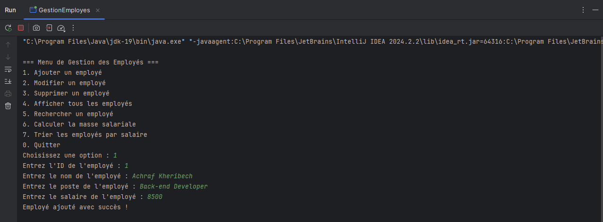

<H2>Application de Gestion des Employés</h2>

<h5> une application pour gérer les employés d’une entreprise. Cette  application doit utiliser les concepts de la programmation orientée objet, avec une structure claire  et un code facilement maintenable. Les données des employés seront représentées par des objets, et  l’application devra manipuler un tableau d’objets pour gérer les employés.</h5>

<h6>BY ACHRAF KHERIBECH</h6>